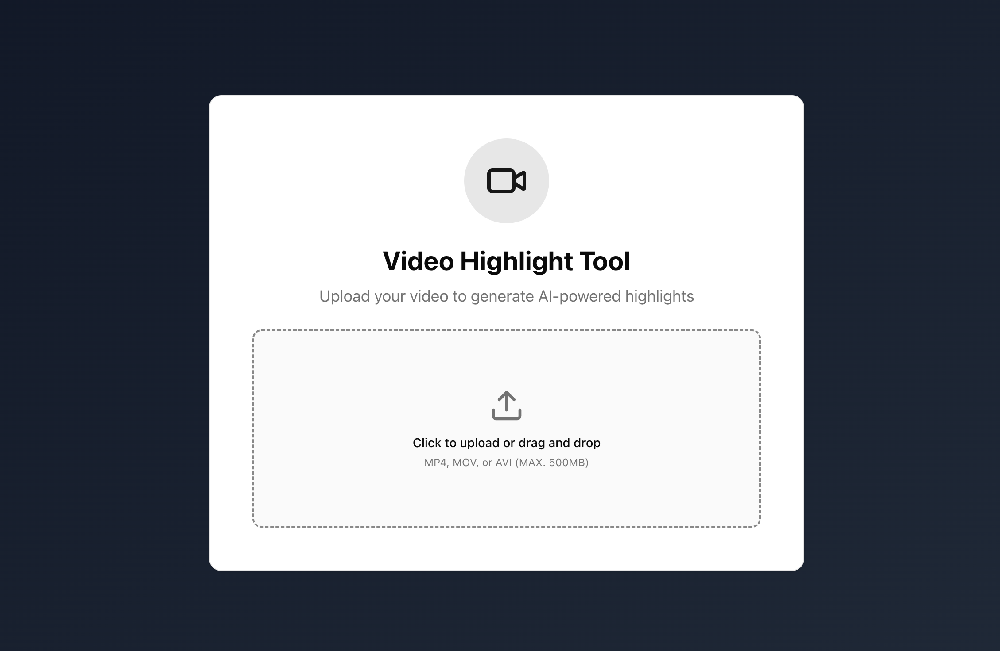
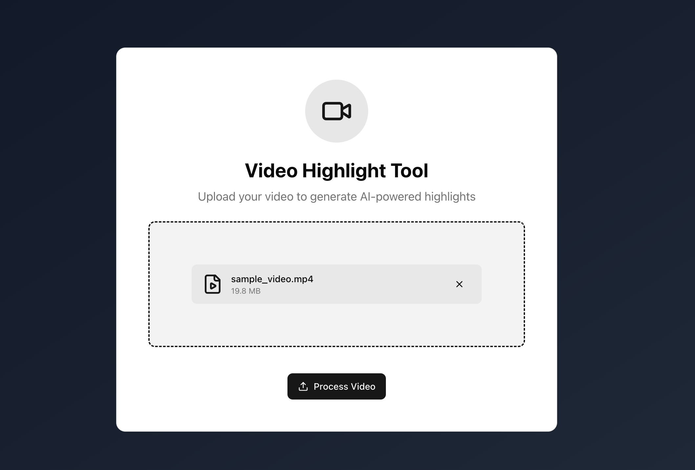

# Video Highlight Tool

You can upload any video; it will be presented in a simulated format later.

## Demo: https://video-highlight-tool-6gv1.vercel.app/

---

## 🖼️ Walkthrough






## ✨ Features

### Core Functionality

- **Video Upload**: Drag-and-drop interface with file validation
- **AI Transcript Generation**: Automatically generated transcript with sections and timestamps (mock API)
- **Split-Screen Interface**:
  - Left panel: Video player with controls and timeline
  - Right panel: Interactive transcript editor
- **Highlight Selection**: Check/uncheck sentences to create your highlight reel
- **Two-Way Synchronization**:
  - Video playback automatically highlights the current sentence
  - Click timestamps to jump to specific moments
  - Debounced auto-scrolling follows video playback
- **Visual Timeline**: See highlighted segments on the timeline bar
- **Text Overlay**: Selected highlight text appears as subtitles

### User Experience

- **Responsive Design**: Desktop (60/40 split), tablet/mobile (stacked)
- **Loading States**: Animated progress with spinner during upload
- **Error Boundaries**: Graceful error handling prevents full app crashes
- **Accessibility**: ARIA labels, keyboard navigation, screen reader support

---

## 🛠️ Tech Stack

| Technology  | Version | Purpose               |
| ----------- | ------- | --------------------- |
| React       | 19.1.1  | UI Framework          |
| TypeScript  | 5.9.3   | Type Safety           |
| Vite        | 7.1.7   | Build Tool            |
| TailwindCSS | v4.1.16 | Styling               |
| Zustand     | 5.0.8   | State Management      |
| Vitest      | 4.0.5   | Testing Framework     |
| Radix UI    | Various | Accessible Components |
| MSW         | 2.11.6  | API Mocking           |

---

## 📚 Why These Technologies?

### React 19.1.1

**Why React 19 specifically:**

- Concurrent features (automatic batching, transitions)
- Improved performance with React Compiler (future-ready)
- Better server components support (migration path if needed)
- Stable release with v18 bug fixes

---

### Vite 7.1.7

**Key benefits:**

- Lightning-fast dev server with instant HMR
- Optimized production builds with Rollup
- Native ESM support (no bundling in dev)
- Simple, intuitive configuration

---

### TypeScript 5.9.3

**Strict mode enabled:**

- Prevents null/undefined errors
- Better type inference
- Forces explicit type annotations
- Safer refactoring

---

### TailwindCSS v4.1.16

**Why Tailwind v4:**

- Faster builds with Rust-based engine
- CSS-first configuration
- Better tree-shaking for production

---

### Zustand 5.0.8

**Perfect for this project:**

- Small app state (transcript, video playback, UI state)
- No need for Redux DevTools complexity
- Fast prototyping
- TypeScript-first design

---

### Radix UI + shadcn/ui

**Benefits:**

- Accessibility built-in (ARIA)
- Unstyled primitives (perfect with Tailwind)
- Composable and production-ready
- shadcn/ui provides styled examples

---

### Vitest 4.0.5 + Testing Library

**Testing Library over Enzyme:**

- Tests behavior not implementation
- User-centric queries
- Encourages accessibility
- Less brittle tests

---

### MSW (Mock Service Worker)

**Benefits:**

- Intercepts network requests realistically
- Same mocks in dev and test
- Service Worker API (standard)

---

### Native HTML5 Video Element

- More control over playback behavior
- No external dependency (~2MB saved)
- Better performance for local videos
- Direct access to video events
- Custom highlight-only playback logic needed

### Event-Driven Architecture

### Kebab-Case File Naming

- Web standards (URLs use kebab-case)
- Faster typing (no shift key)
- Modern convention

Examples:

- `video-player.tsx`, `use-video-player.ts`

## 📊 Complete Dependency List

### Runtime (15 packages)

**UI Framework:**

- `react@19.1.1` + `react-dom@19.1.1`

**UI Components (Radix primitives):**

- `@radix-ui/react-checkbox@1.3.3`
- `@radix-ui/react-progress@1.1.7`
- `@radix-ui/react-slider@1.3.6`
- `@radix-ui/react-slot@1.2.3`

**Styling:**

- `@tailwindcss/vite@4.1.16`
- `class-variance-authority@0.7.1`
- `clsx@2.1.1`
- `tailwind-merge@3.3.1`

**Other:**

- `zustand@5.0.8` (state)
- `lucide-react@0.548.0` (icons)
- `react-dropzone@14.3.8` (file upload)
- `media-chrome@4.15.1` (video controls)

### Development (23 packages)

**Build & TypeScript:**

- `vite@7.1.7`, `@vitejs/plugin-react@5.0.4`
- `typescript@5.9.3`
- `@types/react@19.1.16`, `@types/react-dom@19.1.9`, `@types/node@24.6.0`

**Testing:**

- `vitest@4.0.5`, `@vitest/ui@4.0.5`
- `@testing-library/react@16.3.0`, `@testing-library/user-event@14.6.1`
- `happy-dom@20.0.10`, `jsdom@27.0.1`
- `@playwright/test@1.56.1` (configured, unused)
- `msw@2.11.6`

**Linting:**

- `eslint@9.36.0`, `@eslint/js@9.36.0`
- `typescript-eslint@8.45.0`
- `eslint-plugin-react-hooks@5.2.0`, `eslint-plugin-react-refresh@0.4.22`
- `globals@16.4.0`

**Styling:**

- `tailwindcss@4.1.16`

---

## 🚀 Getting Started

### Installation

```bash
npm install
```

### Development

```bash
npm run dev         # Start dev server
npm run build       # TypeScript compile + Vite production build
npm run preview     # Preview production build
npm run lint        # Run ESLint
```

### Testing

```bash
npm run test              # Run Vitest unit tests
npm run test:coverage     # Generate coverage report
```

---

## 📁 Project Structure

```
src/
├── components/          # React components
│   ├── ui/             # shadcn/ui components (Radix primitives)
│   ├── video/          # Video player, controls, timeline
│   ├── transcript/     # Transcript panel, sections, sentences
│   ├── upload/         # Upload area, dropzone, loading
│   └── layout/         # Layout components
├── hooks/              # Custom React hooks
│   └── use-video-player.ts  # Main video playback hook
├── stores/             # Zustand state management
│   └── transcript-store.ts  # Central store
├── utils/              # Utility functions
│   ├── time-utils.ts        # Time formatting
│   └── highlight-playback.ts # Segment calculations
├── constants/          # Centralized constants
│   └── index.ts
├── types/              # TypeScript type definitions
├── __tests__/          # Vitest test files (111 tests)
└── test/               # Test setup
```

---

## 🚀 Deployment

### Vercel (Recommended)

```bash
npm install -g vercel
vercel --prod
```

### Netlify

```bash
npm install -g netlify-cli
netlify deploy --prod
```
